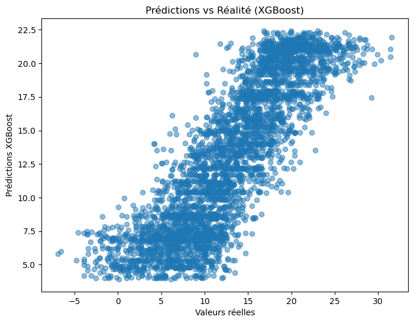
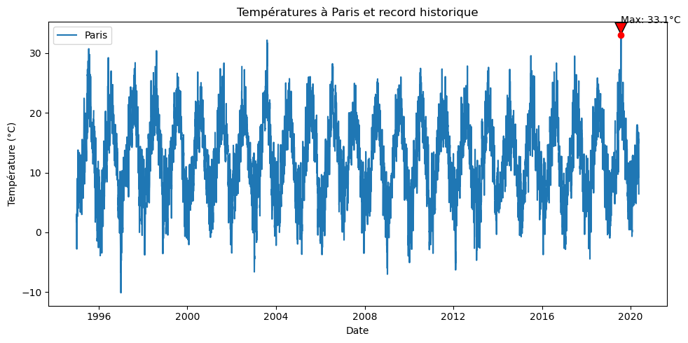
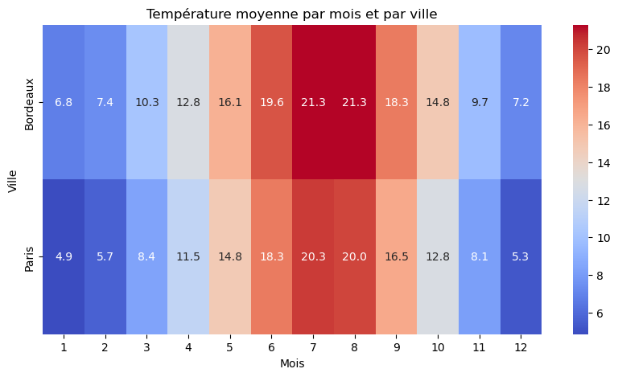
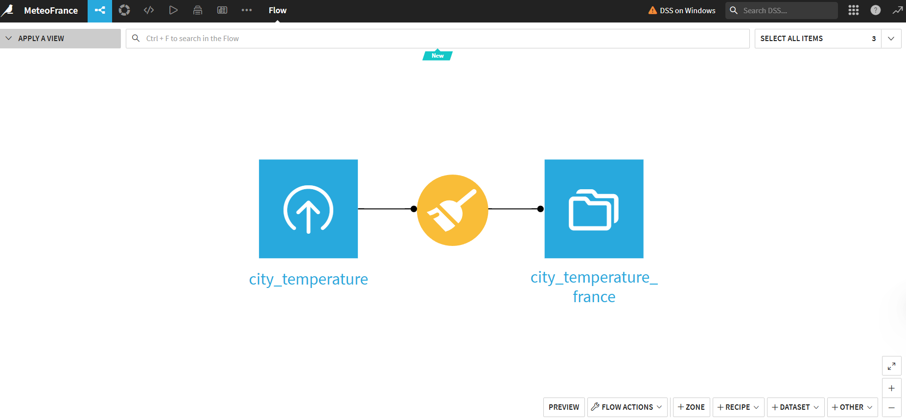
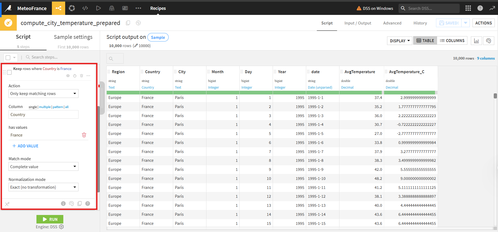
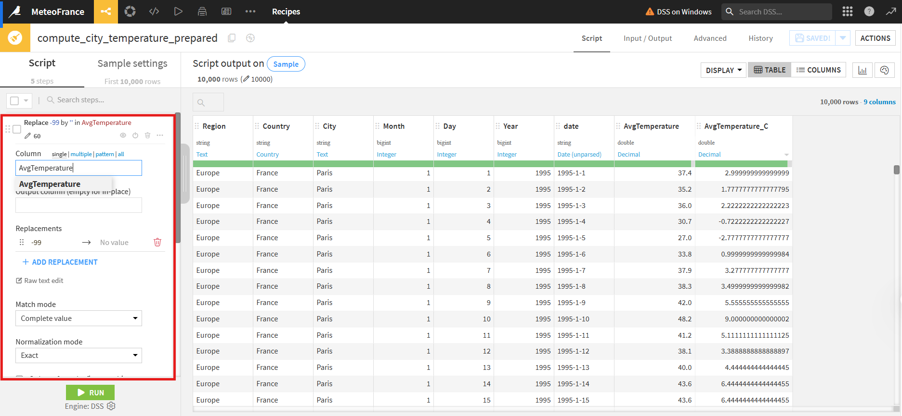
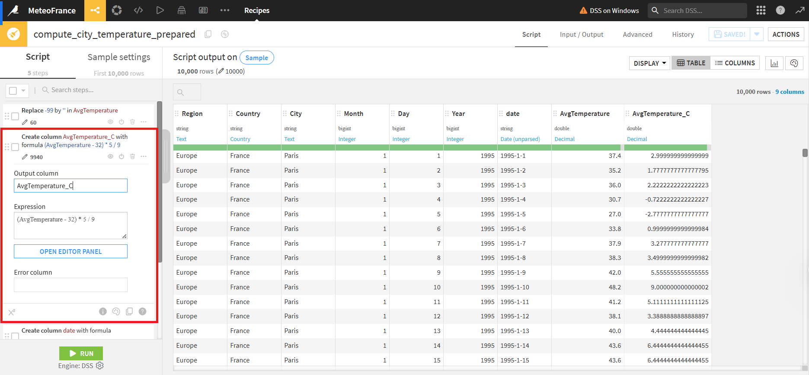

# 🌦️ Prédiction des Températures Quotidiennes en France

Projet data science de bout en bout pour l’analyse, la préparation et la prédiction des températures en France à partir du dataset Kaggle "Daily Temperature of Major Cities".  
Pipeline : Dataiku pour la préparation et le dashboard, Python/Anaconda pour l’analyse et la modélisation, XGBoost pour la prédiction avancée.

---
## 📑 Table des matières

1. [Présentation](#présentation)
2. [Structure du projet](#structure-du-projet)
3. [Environnement technique](#environnement-technique)
4. [Étapes du projet](#étapes-du-projet)
    - [1. Nettoyage & préparation Dataiku](#1-nettoyage--préparation-dataiku)
    - [2. Analyse exploratoire (EDA)](#2-analyse-exploratoire-eda)
    - [3. Modélisation & comparaison](#3-modélisation--comparaison)
    - [4. Dashboard Dataiku](#4-dashboard-dataiku)
5. [Visualisations](#visualisations)
6. [Comparaison des modèles](#comparaison-des-modèles)
7. [Reproduire ce projet](#reproduire-ce-projet)
8. [Pistes d’amélioration](#pistes-damélioration)
9. [Ressources](#ressources)

---

## Présentation

Ce projet illustre une démarche data science complète sur des données météorologiques françaises :
- Préparation/cleaning avancés sur Dataiku,
- Analyse exploratoire et visualisations (Jupyter Notebook, Python),
- Modélisation prédictive (régression linéaire, features trigonométriques, XGBoost),
- Restitution interactive via dashboard Dataiku.

**Objectif** : Prédire la température quotidienne selon la saison et la ville, tout en expliquant l’importance du feature engineering et du choix des modèles.

## 📂 Project Structure:

```bash
/meteo-france-prediction/
├── README.md
├── data/
│ └── (extraits ou scripts de téléchargement)
├── notebooks/
│ └── MeteoFrance_EDA_Modelisation.ipynb
├── dataiku-flow/
│ └── (captures d’écran ou exports de recettes Dataiku)
├── dashboard/
│ ├── pred_vs_real_linear.png
│ ├── pred_vs_real_xgboost.png
│ ├── temp_paris_record.png
│ └── heatmap_ville_mois.png
├── requirements.txt
└── .gitignore
```

---

## Environnement technique

- **Dataiku DSS** : Recettes visuelles pour le cleaning et la préparation, dashboard interactif.
- **Python (Anaconda/Jupyter)** : Analyse exploratoire, modélisation (pandas, numpy, matplotlib, seaborn, scikit-learn, xgboost).
- **Reproductibilité** : Dépendances dans `requirements.txt`.
- **Dataset original** : [Kaggle - Daily Temperature of Major Cities](https://www.kaggle.com/datasets/sudalairajkumar/daily-temperature-of-major-cities)

---

## Étapes du projet

### 1. Nettoyage & préparation Dataiku

- Import du dataset Kaggle et filtrage France
- Suppression des valeurs aberrantes (`AvgTemperature = -99`)
- Conversion des températures en °C
- Création d’une colonne `date`
- Export du jeu de données propre

### 2. Analyse exploratoire (EDA)

- Statistiques descriptives sur les températures
- Visualisations : histogrammes, courbes temporelles, heatmaps, boxplots
- Découverte des tendances saisonnières et différences inter-villes

### 3. Modélisation & comparaison

- **Baseline** : Régression linéaire simple (jour de l’année)
- **Feature engineering** : Ajout de sin/cos(day_of_year) pour la saisonnalité
- **XGBoost** : Modélisation avancée intégrant la ville et la saison
- **Évaluation** : RMSE, R², comparaisons graphiques (Prédictions vs Réalité)
- **Synthèse** : Tableau comparatif des modèles

### 4. Dashboard Dataiku

- Slides thématiques : distribution, saisonnalité, comparaison villes, performance des modèles
- Insights : histogrammes, courbes, scatter plots, heatmaps, boxplots
- Filtres dynamiques (ville, période)

---

## Visualisations

### Régression linéaire : Prédictions vs Réalité

> Le modèle linéaire simple ne capte pas la saisonnalité. La prédiction est très éloignée des valeurs réelles.

---

### XGBoost : Prédictions vs Réalité

> XGBoost améliore nettement le fit. Les prédictions suivent bien les valeurs réelles, avec une légère saturation aux extrêmes.

---

### Températures à Paris et record historique

> Courbe de température à Paris de 1995 à 2020, record de chaleur annoté.

---

### Heatmap : Température moyenne par mois et par ville

> La saisonnalité et les différences de climat entre Paris et Bordeaux sont immédiatement visibles.

---

## Comparaison des modèles

| Modèle                         | RMSE   | R²     |
|--------------------------------|--------|--------|
| Régression linéaire simple     | 6.33   | 0.03   |
| Régression linéaire (sin/cos)  | 3.50   | 0.70   |
| XGBoost                        | 3.41   | 0.72   |

- Le passage à des features adaptées (sin/cos) et XGBoost permet de diviser l’erreur par deux et d’expliquer 72 % de la variance.

---

## Reproduire ce projet

1. **Cloner ce dépôt**
2. **Installer l’environnement**
    - Avec conda :  
      ```bash
      conda env create -f environment.yml
      conda activate meteo-france
      ```
    - Ou avec pip :  
      ```bash
      pip install -r requirements.txt
      ```
3. **Télécharger le dataset sur Kaggle**
4. **Lancer Jupyter Notebook**
    ```bash
    jupyter notebook notebooks/MeteoFrance_EDA_Modelisation.ipynb
    ```
5. **Ouvrir Dataiku DSS** pour explorer le flow de nettoyage ou le dashboard.

---

## Pistes d’amélioration

- Tuning hyperparamètres XGBoost (GridSearchCV)
- Ajout de nouvelles variables météo (précipitation, vent…)
- Modélisation time-series (Prophet, LSTM…)
- Déploiement du pipeline en dashboard web (Streamlit, Dash…)

---

## Ressources

- [Dataset Kaggle](https://www.kaggle.com/datasets/sudalairajkumar/daily-temperature-of-major-cities)
- [Documentation Dataiku](https://doc.dataiku.com/)
- [XGBoost Python API](https://xgboost.readthedocs.io/en/latest/python/index.html)


## Approche no code (Dataiku)

La préparation et le nettoyage des données ont été réalisés de manière totalement visuelle grâce à Dataiku DSS, sans code Python :

- **Filtrage**  
  Utilisation d’une recette “Filter” pour ne conserver que les lignes où `Country` = ‘France’.

- **Nettoyage des valeurs aberrantes**  
  Recette “Filter” pour supprimer les lignes où `AvgTemperature = -99`, puis recette “Clean” pour gérer les NaN éventuels.

- **Transformation des températures**  
  Recette “Formula” : conversion des températures de Fahrenheit à Celsius via une formule personnalisée.

- **Création de la colonne date**  
  Recette “Formula” pour assembler les champs `Year`, `Month`, `Day` en un seul champ `date` (format AAAA-MM-JJ).

- **Export**  
  Recette “Export” pour générer le dataset final utilisé pour l’EDA et la modélisation en Python.

*Voir `/dataiku-flow/` pour des captures du flow et des recettes utilisées.*

### Approche no code (Dataiku) – pipeline de préparation

Le pipeline de nettoyage et de préparation a été réalisé via des recettes visuelles dans Dataiku DSS :


*Exemple de flow Dataiku : chaque étape correspond à une recette visuelle.*

- Filtrage des lignes France → 
- Nettoyage des valeurs aberrantes → 
- Conversion des températures → 

*Toutes les transformations sont traçables et sans code. L’export du jeu propre a ensuite permis de basculer vers le notebook Python pour l’analyse approfondie.*

---

*Réalisé par Josué KOFFI [LinkedIn](https://www.linkedin.com/in/josu%C3%A9-kinsanh-nixxon-koffi/) . Projet open source et pédagogique, toute contribution est bienvenue !*